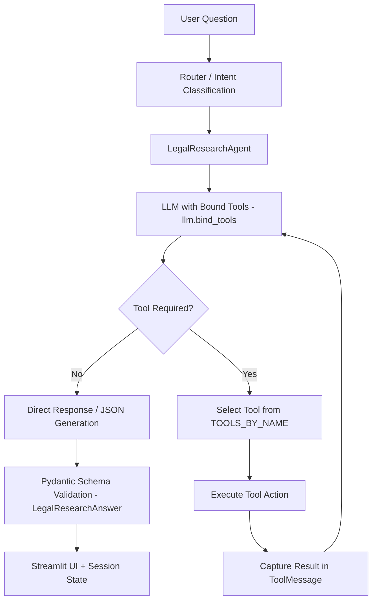
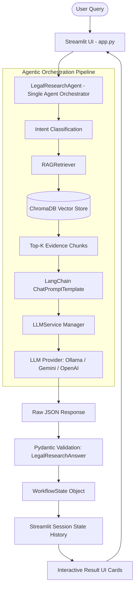

# Crime Scene Investigation RAG — Legal Intelligence Platform ⚖️

An advanced, AI-powered **Single-Agent RAG (Retrieval-Augmented Generation)** application engineered for legal case research, evidence synthesis, witness testimony comparison, contradiction analysis, and timeline extraction.

Upgraded with **Experiment 3 (LangChain + Multi-Provider LLM Integration)** and **Experiment 4 (Structured Outputs + Pydantic Validation + Session State History & Premium Dark UI)**.

> **Key Architectural Principle**: This system is built around **ONE central AI agent: `LegalResearchAgent`**. It is a single-agent system where `LegalResearchAgent` acts as the central orchestrator, coordinating intent classification, evidence retrieval, LLM reasoning, structured output generation, and Pydantic schema validation.

Built with **Python + Streamlit**, following the **AgenticAI Learning Architecture**:

```text
Streamlit UI
    ↓
Python Backend
    ↓
LegalResearchAgent (Single Agent / Orchestrator)
├── Intent Classification
├── RAGRetriever
│   └── ChromaDB Vector Store
├── LangChain Prompt Construction
│   └── ChatPromptTemplate
├── LLMService
│   ├── Ollama (qwen2.5)
│   ├── Gemini
│   └── OpenAI
└── Pydantic Validation (LegalResearchAnswer & SourceModel)
    ↓
WorkflowState
    ↓
Streamlit Result UI + Session History
```

> **Disclaimer**: This system is an AI-assisted legal research tool. It provides information based on documents available in its knowledge base and does not constitute formal legal advice.

---

## 1. Key Features & Experiment Upgrades

### Experiment 3 — LangChain & Provider Integration
- **LangChain Orchestration**: Powered by `langchain-core` and `ChatPromptTemplate` for dynamic legal research prompt formatting and chain execution.
- **Multi-Provider LLM Support**:
  - **Local Ollama**: Offline-first legal analysis powered by `qwen2.5:1.5b` (or custom local models) via `ChatOllama`.
  - **Google Gemini**: Cloud reasoning integration via `gemini-1.5-flash` / `gemini-pro`.
  - **OpenAI**: GPT-4o / GPT-3.5 support.
- **Ollama Health Check & Structured Native Support**: Automatic background health probing with visual notifications, fallback handling, and native schema constraint enforcement for local models.

### Experiment 4 — Structured Outputs & Session State
- **Strict Pydantic Schema Validation**: Every output is schema-validated using Pydantic models (`LegalResearchAnswer` and `SourceModel`).
- **Structured Legal Analytics**: Enforces breakdown into:
  - Query Intent Classification (`CASE_SUMMARY`, `TIMELINE`, `WITNESS_ANALYSIS`, `CONTRADICTION_DETECTION`, `EVIDENCE_EVALUATION`, `LEGAL_SECTION_CHECK`, `GENERAL_RESEARCH`)
  - Grounded Legal Answer
  - Key Findings
  - Evidence Breakdown
  - Knowledge Base Limitations
  - Verifiable Citation Sources (Document name, snippet, page number, relevance score)
- **Persistent Session State History**: Full active-session conversation history tracking with interactive expanders and raw JSON inspection.
- **History Control**: One-click clear session history functionality without wiping vector store indexes.

### Premium Dark-Themed User Experience
- High-contrast, glassmorphism-inspired dark UI with custom typography (`Inter` & `JetBrains Mono`).
- Interactive metrics dashboard displaying Knowledge Base statistics, Document counts, and Vector Chunk metrics.
- Comprehensive document upload suite supporting PDF, DOCX, and TXT legal files with chunking preview and vector indexing.
- One-click **Load Pre-packaged Synthetic Case Files** for instant zero-config demonstration.

---

## 2. Single-Agent Architecture

The Crime Scene Investigation RAG system uses **exactly one AI agent**: `LegalResearchAgent`. It is **NOT** a multi-agent system or agent swarm.

`LegalResearchAgent` acts as the central orchestrator/coordinator of the entire legal research workflow. Other modules in the codebase—such as `RAGRetriever`, `LLMService`, `VectorStoreManager`, `LegalTextSplitter`, and Pydantic schemas—are **supporting deterministic services and data structures**, not separate AI agents.

```text
User Query
    ↓
LegalResearchAgent (Central Coordinator)
    ↓
Intent Classification
    ↓
RAG Retrieval (RAGRetriever + ChromaDB)
    ↓
LLM Execution (LLMService via LangChain)
    ↓
Pydantic Validation (LegalResearchAnswer)
    ↓
Structured Legal Answer (WorkflowState)
```

---

## 3. Role of LegalResearchAgent

The `LegalResearchAgent` ([`agent/legal_research_agent.py`](file:///Users/sathwiknaag/Desktop/%20/Projects/RAG%20Agentic%20Ai/agent/legal_research_agent.py)) is the **brain and coordinator of the application**. Rather than directly implementing every operation itself, it orchestrates the workflow by delegating specialized tasks to supporting services.

### Core Responsibilities:
1. **Receives User Query**: Accepts raw legal research queries from the Streamlit UI.
2. **Classifies Intent**: Determines query category (`CASE_SUMMARY`, `TIMELINE`, `WITNESS_ANALYSIS`, `CONTRADICTION_DETECTION`, etc.) using keyword heuristics and LLM prompt context.
3. **Determines Workflow Strategy**: Chooses chunk retrieval limits ($Top-K$) and context formatting based on query intent.
4. **Calls RAG Retriever**: Invokes `RAGRetriever` to pull relevant legal evidence chunks and relevance scores from ChromaDB.
5. **Constructs Context & Prompt**: Passes retrieved evidence chunks and intent context to `legal_research_prompt.py` to build LangChain `ChatPromptTemplate` instances.
6. **Invokes LLM Service**: Calls `LLMService` to execute inference across Ollama, Gemini, or OpenAI.
7. **Receives Structured JSON**: Obtains JSON formatted output adhering to legal analysis guidelines.
8. **Validates Output Schema**: Parses and validates raw JSON against the `LegalResearchAnswer` Pydantic model.
9. **Handles Validation Failures**: Triggers fallback strategies or retry logs when output fails schema validation.
10. **Returns Workflow State**: Packs structured answer, intent, source citations, and timing metrics into a `WorkflowState` object for `app.py`.
11. **Enables UI Rendering**: Allows Streamlit to render structured cards and store active session state history.

```text
LegalResearchAgent
├── Intent Classification
├── Evidence Retrieval
├── Prompt/Context Construction
├── LLM Invocation
├── Structured Output Validation
└── Final Workflow State Assembly
```

---

## 4. Agent Reasoning → Planning → Action Workflow

The architecture implements a practical **Reasoning → Planning → Action → Validation → Response** agentic workflow loop:

```text
User Request: "What contradictions exist between witness statements and CCTV footage?"
    ↓
[Reasoning]
Identify query intent as CONTRADICTION_DETECTION requiring comparison between witness statements and CCTV analysis reports.
    ↓
[Planning]
Determine that relevant witness depositions and CCTV log chunks must be retrieved from ChromaDB, combined into context, and analyzed for timestamp/location discrepancies.
    ↓
[Action]
Execute RAGRetriever query, obtain top-K evidence chunks, construct legal research prompt, and invoke selected LLM via LLMService.
    ↓
[Validation]
Parse raw LLM output against Pydantic LegalResearchAnswer schema to ensure structured fields (grounded answer, key findings, evidence summary, limitations, sources) are present and valid.
    ↓
[Response]
Return populated WorkflowState object to Streamlit app.py for interactive card rendering and session state tracking.
```

---

## 5. Complete Query Execution Flow

```text
User Query
    ↓
app.py (Streamlit UI)
    ↓
LegalResearchAgent.run_workflow(query)
    ↓
Intent Classification (IntentType)
    ↓
RAGRetriever (Relevance scoring & filtering)
    ↓
VectorStoreManager / ChromaDB (Top-K vector lookup)
    ↓
Top-K Relevant Evidence Chunks
    ↓
legal_research_prompt.py (LangChain ChatPromptTemplate)
    ↓
LLMService (Unified manager for Ollama / Gemini / OpenAI)
    ↓
Ollama / Gemini / OpenAI LLM Inference
    ↓
Structured JSON Response
    ↓
LegalResearchAnswer Pydantic Schema Validation
    ↓
WorkflowState Object Assembly
    ↓
app.py (Render interactive UI cards & save to st.session_state)
```

### Flow Breakdown:
1. **User Query Submission**: User submits a legal query via `app.py`.
2. **Agent Entry Point**: `app.py` passes the query to `LegalResearchAgent.run_workflow(query)`.
3. **Intent Classification**: Agent categorizes query intent (`CASE_SUMMARY`, `CONTRADICTION_DETECTION`, etc.).
4. **Vector Retrieval**: `RAGRetriever` queries `VectorStoreManager` (ChromaDB) to fetch top-K evidence chunks.
5. **Prompt Formatting**: `legal_research_prompt.py` formats chunks and query into a LangChain `ChatPromptTemplate`.
6. **LLM Execution**: `LLMService` sends formatted prompt to active provider (Ollama, Gemini, or OpenAI).
7. **Schema Validation**: Raw response is validated against Pydantic `LegalResearchAnswer` schema.
8. **State Construction**: Agent encapsulates result, citations, and metadata into a `WorkflowState` object.
9. **UI & History Rendering**: `app.py` renders interactive result cards, citation expanders, and session history logs.

---

## 6. Agent vs. Supporting Components

| Component | Is it an Agent? | Responsibility |
| :--- | :---: | :--- |
| **`LegalResearchAgent`** | **YES — Single Agent** | Central orchestrator managing intent, retrieval, LLM call, validation, and state packaging. |
| **`RAGRetriever`** | No | Performs similarity searches and calculates chunk relevance scores. |
| **`VectorStoreManager`** | No | Manages persistent ChromaDB vector collections and embeddings index. |
| **`EmbeddingService`** | No | Generates text vector embeddings via Sentence-Transformers / HuggingFace. |
| **`LLMService`** | No | Provides unified multi-provider interface (Ollama, Gemini, OpenAI). |
| **`LegalTextSplitter`** | No | Chunks legal documents respecting section boundaries and chunk overlaps. |
| **`DocumentLoader`** | No | Extracts raw text and metadata from PDF, DOCX, and TXT legal files. |
| **Pydantic Schemas** | No | Validates JSON structure (`LegalResearchAnswer`, `SourceModel`). |
| **Streamlit `app.py`** | No | Web user interface, input forms, metric displays, and session history management. |

---

## 7. Concrete Example Execution

### Example Query:
> *"What contradictions exist between witness statements and CCTV footage regarding the timeline?"*

```text
1. User submits query in Streamlit interface.
2. LegalResearchAgent receives query.
3. Agent identifies intent -> CONTRADICTION_DETECTION.
4. RAGRetriever searches ChromaDB collection for witness statements and CCTV log chunks.
5. Relevant chunks (e.g., Security Guard Ankit Sharma's statement vs. CCTV Exit Log) are retrieved.
6. LangChain prompt builder constructs legal research context prompt.
7. Selected LLM (e.g., Ollama qwen2.5:1.5b) processes context and generates structured JSON response.
8. Pydantic validates response against LegalResearchAnswer schema.
9. Agent packages output into WorkflowState.
10. Streamlit renders:
    - Grounded Legal Answer (pointing out timestamp discrepancies)
    - Key Findings (e.g., CCTV shows exit at 21:40 HRS vs. witness statement claiming 21:55 HRS)
    - Evidence Breakdown (bulleted list of conflicting exhibits)
    - Knowledge Base Limitations
    - Verifiable Source Citations with document names and page numbers
```

---

## 8. Why Single-Agent Architecture?

The project deliberately adopts a **Single-Agent Architecture** because the application has one primary, focused objective: **legal research and evidence analysis across a case knowledge base**.

A single central agent (`LegalResearchAgent`) can effectively coordinate multiple specialized software components (retriever, vector store, prompt templates, LLM service, Pydantic validator) without the overhead, latency, and non-deterministic behavior of multi-agent negotiation.

```text
Single Agent System (Implemented)
    LegalResearchAgent
           ↓
   Coordinates Services
 (Retriever, VectorStore, LLMService, Schemas)
```

*VS.*

```text
Multi-Agent Swarm (Not Required / Not Implemented)
   Agent 1 (Search Agent) ➔ Agent 2 (Reasoning Agent) ➔ Agent 3 (Critic Agent)
```

---

## 9. Agentic Tool Calling Architecture (Advanced Experiment 6B Integration)

The platform is upgraded with a dynamic **LangChain Tool-Calling Architecture**. Instead of relying on hardcoded keyword routing or rigid if-else blocks (such as `if "attendance" in question`), the system uses LLM tool binding (`llm.bind_tools(tools)`). The LLM dynamically inspects query requirements, selects the appropriate tool, generates arguments, receives execution results via `ToolMessage`, and synthesizes a grounded answer.



### Key Architectural Concepts:
1. **What a Tool is**: A decorated Python function (`@tool` from `langchain_core.tools`) with type annotations and precise docstrings explaining when and how it should be used.
2. **Why the Project uses Tools**: Allows the LLM to autonomously trigger RAG retrieval (`retrieve_case_evidence`), timeline extraction (`extract_timeline_events`), witness contradiction cross-examination (`analyze_witness_contradictions`), or FIR summaries (`summarize_case_facts`) based on query intent.
3. **How `@tool` Works**: Converts standard functions into LangChain-compatible JSON schema objects exposed to the chat model.
4. **Tool Registration**: Registered in `agent/tools.py` in `LEGAL_TOOLS` and indexed in `TOOLS_BY_NAME`.
5. **How `bind_tools()` Works**: Attaches tool JSON schemas directly to `ChatOllama` / `ChatOpenAI` chat models so the LLM outputs `response.tool_calls`.
6. **How the LLM Selects a Tool**: The LLM reads the system prompt and tool descriptions to select tools dynamically without hardcoded keyword rules.
7. **Tool Execution Loop**: `LegalResearchAgent` iterates up to `MAX_TOOL_ITERATIONS = 5`:
   - Inspects `response.tool_calls`
   - Maps `tool_name` to `TOOLS_BY_NAME`
   - Executes the tool with `tool_args`
   - Returns a `ToolMessage(content=result, tool_call_id=tool_id)` to the message history
8. **Error Handling**: Graceful fallback handling for unknown tools or execution failures without exposing raw stack traces to the user.
9. **UI Visualization**: Streamlit dashboard features an expandable **EXECUTED AGENT TOOLS** card showing invoked tool names, arguments, execution status, and result previews.

---

## 10. System Architecture Diagram



---

## 10. Directory & File Structure

```text
RAG Agentic Ai/
├── app.py                     # Streamlit Legal Intelligence Dashboard & Chat UI
├── config.py                  # Environment, paths, chunking & LLM configurations
│
├── agent/
│   ├── __init__.py
│   └── legal_research_agent.py # Central Legal Research Agent (LangChain + Pydantic execution)
│
├── rag/
│   ├── __init__.py
│   ├── document_loader.py     # PDF, DOCX & TXT Document Loaders
│   ├── text_splitter.py       # Legal-Aware Text Splitter / Chunker
│   ├── embeddings.py          # HuggingFace & Sentence-Transformer Embeddings
│   ├── vector_store.py        # Persistent ChromaDB Manager & Collection Indexer
│   └── retriever.py           # RAG Retriever & Relevance Scorer
│
├── llm/
│   ├── __init__.py
│   └── llm_service.py         # Multi-provider LLM Manager (Ollama, Gemini, OpenAI)
│
├── prompts/
│   ├── __init__.py
│   └── legal_research_prompt.py # LangChain ChatPromptTemplates for legal analysis
│
├── models/
│   ├── __init__.py
│   └── schemas.py             # Pydantic Schemas (LegalResearchAnswer, SourceModel, IntentType)
│
├── utils/
│   ├── __init__.py
│   └── helpers.py             # Formatting, JSON conversion, and utility functions
│
├── sample_data/               # Complete Synthetic Criminal Case Legal Dataset (State vs. Ramesh)
│   ├── 01_FIR_State_vs_Ramesh.txt
│   ├── 02_Witness_Statements.txt
│   ├── 03_CCTV_Analysis_Report.txt
│   ├── 04_Forensic_Lab_Report.txt
│   ├── 05_Postmortem_Report.txt
│   ├── 06_Police_Investigation_Report.txt
│   ├── 07_Accused_Statement.txt
│   └── 08_Court_Judgment.txt
│
├── data/
│   ├── documents/             # Uploaded raw case files
│   └── vectorstore/           # Persistent ChromaDB database
│
├── scratch/                   # Test, verification, and data generation scripts
│   ├── test_pipeline.py                  # Pipeline & Pydantic validation test suite
│   ├── generate_synthetic_dataset.py     # Generator for realistic 8-document legal case files
│   └── verify_ollama_structured_output.py# Automated verification test for Ollama structured output
│
├── .env.example               # Example environment variable configurations
├── .gitignore                 # Git ignore rules
├── requirements.txt           # Project dependencies
└── README.md                  # Project documentation
```

---

## 11. Synthetic Case Dataset: *State of Maharashtra vs. Ramesh Kumar*

The platform includes a complete, realistic multi-document criminal case file in `sample_data/` covering:
1. **First Information Report (FIR No. 142/2024)**: Incident report from Apex Towers murder case under IPC 302/392/120B / BNSS.
2. **Witness Statements**: Detailed depositions from Security Guard Ankit Sharma, Receptionist Priya Verma, Accountant Suresh Joshi, and Alibi Witness Sunita Kumar.
3. **CCTV Analysis Report**: Camera logs and timestamped entrance/exit footage details.
4. **Forensic Lab Report**: Fingerprint identification, 9mm ballistics analysis, bloodstain DNA profiling, and digital audit ledger analysis.
5. **Postmortem Examination Report**: Cause of death, gunshot wound trajectory, and estimated time of death (21:15 - 21:45 HRS).
6. **Police Investigation & Charge Sheet**: Investigation summary, motives, timeline reconstruction, and recovery of stolen briefcase.
7. **Accused Statement (Section 313 Cr.P.C.)**: Defence plea of innocent alibi and financial dispute context.
8. **Court Judgment & Verdict**: Judicial assessment of circumstantial evidence, chain of custody, witness reliability, and conviction order.

---

## 12. Quick Start & Setup

### Prerequisites
- **Python 3.10+** installed
- *(Optional)* [Ollama](https://ollama.com) installed locally for local LLM inference (`ollama pull qwen2.5:1.5b`).

### Step 1: Clone & Setup Environment
```bash
# Navigate to project directory
cd "RAG Agentic Ai"

# Activate virtual environment
source .venv/bin/activate

# Install required packages
pip install -r requirements.txt
```

### Step 2: Environment Configuration
Copy `.env.example` to `.env` and set your preferred provider settings:
```bash
cp .env.example .env
```

Example `.env` configurations:

**For Local Ollama (Default):**
```env
LLM_PROVIDER=ollama
OLLAMA_BASE_URL=http://localhost:11434
OLLAMA_MODEL=qwen2.5:1.5b
```

**For Google Gemini:**
```env
LLM_PROVIDER=gemini
GEMINI_API_KEY=your_gemini_api_key_here
GEMINI_MODEL=gemini-1.5-flash
```

---

## 13. Running the Application

Launch the Streamlit web application:
```bash
streamlit run app.py
```

Access the dashboard at `http://localhost:8501`.

### Usage Guide:
1. **Load Sample Documents / Upload Case Files**: Use the sidebar button **"Load Sample Case Files"** to index all 8 synthetic legal records into ChromaDB, or upload your own PDF/DOCX/TXT files.
2. **Configure Retriever & LLM**: Choose your active LLM provider (Ollama / Gemini / OpenAI) and chunking parameters in the sidebar settings.
3. **Submit Research Query**: Enter your query (e.g., *"What were the contradictions between witness statements and CCTV footage regarding the timeline?"*).
4. **Inspect Findings**: View structured outputs categorized into Grounded Answer, Key Findings, Evidence Breakdown, Limitations, and Sources.

---

## 14. Automated Testing & Verification

Run the automated verification scripts:

```bash
# 1. Verify End-to-End Pipeline & Pydantic Validation
python scratch/test_pipeline.py

# 2. Verify Ollama Structured JSON Output Generation
python scratch/verify_ollama_structured_output.py

# 3. (Optional) Re-generate Synthetic Dataset Files
python scratch/generate_synthetic_dataset.py
```

---

## 15. License & Disclaimers

This project is created for research and educational purposes under the AgenticAI framework. Please consult qualified legal professionals for official legal matters.


