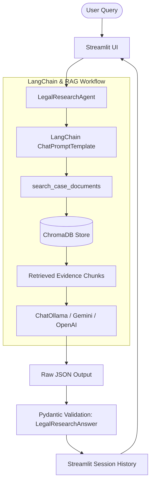

# Crime Scene Investigation RAG — Legal Case Research Assistant ⚖️

An AI-powered **Single-Agent RAG (Retrieval-Augmented Generation)** application designed for legal case research, evidence synthesis, witness testimony comparison, and timeline extraction.

Upgraded with **Experiment 3 (LangChain + Ollama)** and **Experiment 4 (Structured Outputs + Pydantic Validation + Session State History)**.

Built with **Python + Streamlit**, following the **AgenticAI Learning Architecture**:

```text
Streamlit
    ↓
Python
    ↓
LangChain
    ↓
Single Legal Research Agent
    ↓
RAG / Knowledge Base
    ↓
Ollama (qwen2.5:1.5b) / Gemini / OpenAI / Local
    ↓
Structured JSON Response
    ↓
Validated Pydantic Python Object
    ↓
Streamlit Display
```

> **Disclaimer**: This system is an AI-assisted legal research tool. It provides information based on documents available in its knowledge base and does not constitute formal legal advice.

---

## 1. Primary Objectives & Upgraded Features

### Experiment 3 Upgrades — LangChain & Ollama Integration
- **LangChain Orchestration**: Utilizes LangChain (`langchain-core`, `langchain-ollama`) and `ChatPromptTemplate` for legal research prompt resolution.
- **Ollama Support**: First-class local LLM integration via `ChatOllama` (`qwen2.5:1.5b` at `http://localhost:11434`).
- **Ollama Health Check**: Graceful fallback and user notices when local Ollama service is offline.

### Experiment 4 Upgrades — Structured Outputs & State Management
- **Pydantic Schema Validation**: Every response is validated using Pydantic (`LegalResearchAnswer` & `SourceModel`).
- **Structured Fields**: Enforces `query`, `intent`, `answer`, `key_findings`, `evidence_summary`, `limitations`, and `sources`.
- **Session State History**: Persistent active session conversation history (`st.session_state.history`).
- **Clear History**: Dedicated button to clear conversation history without affecting the vector database.
- **Input Validation**: Strict checks for empty queries, empty knowledge base, and model parsing errors with raw JSON debugging expanders.

---

## 2. System Architecture



---

## 3. Project Structure

```text
crime_scene_rag/
│
├── app.py                     # Streamlit UI with Session State History & Pydantic presentation
├── config.py                  # Environment & Ollama configuration settings
│
├── agent/
│   ├── __init__.py
│   └── legal_research_agent.py # Single Central Agent (LangChain + Pydantic validation)
│
├── rag/
│   ├── __init__.py
│   ├── document_loader.py     # PDF/DOCX/TXT Legal Document Loader
│   ├── text_splitter.py       # Legal-Aware Text Chunker
│   ├── embeddings.py          # Embedding Service
│   ├── vector_store.py        # Persistent ChromaDB Manager
│   └── retriever.py           # RAG Retriever & Evidence Scorer
│
├── llm/
│   ├── __init__.py
│   └── llm_service.py         # LangChain ChatOllama & Pydantic validation service
│
├── prompts/
│   ├── __init__.py
│   └── legal_research_prompt.py # LangChain ChatPromptTemplate
│
├── models/
│   ├── __init__.py
│   └── schemas.py             # Pydantic LegalResearchAnswer & SourceModel schemas
│
├── sample_data/               # Pre-packaged case data for instant testing
│   ├── FIR_State_vs_Ramesh.txt
│   └── Witness_Statements_Case_001.txt
│
├── data/
│   ├── documents/             # Uploaded document storage
│   └── vectorstore/           # Persistent ChromaDB store
│
├── .env.example
├── .gitignore
├── requirements.txt
└── README.md
```

---

## 4. Installation & Setup

### Prerequisites
- Python 3.10+ installed
- (Optional) [Ollama](https://ollama.com) installed locally for local LLM mode.

### Step 1: Setup Virtual Environment
```bash
# Navigate to project root
cd "RAG Agentic Ai"

# Activate environment
source .venv/bin/activate

# Install dependencies
pip install -r requirements.txt
```

### Step 2: Configure Environment Variables
Copy `.env.example` to `.env`:
```env
LLM_PROVIDER=ollama
OLLAMA_BASE_URL=http://localhost:11434
OLLAMA_MODEL=qwen2.5:1.5b
```

---

## 5. Running the Application

Launch the Streamlit app:
```bash
streamlit run app.py
```

Open your browser at `http://localhost:8501`.

---

## 6. Verification & Test Execution

Run the automated test suite verifying Experiment 3 & 4 integration:
```bash
.venv/bin/python scratch/test_pipeline.py
```
