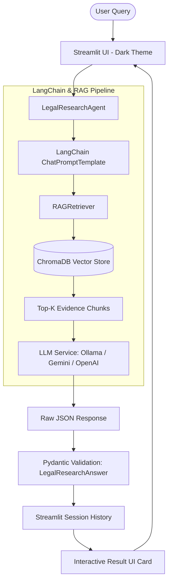

# Crime Scene Investigation RAG — Legal Intelligence Platform ⚖️

An advanced, AI-powered **Single-Agent RAG (Retrieval-Augmented Generation)** application engineered for legal case research, evidence synthesis, witness testimony comparison, contradiction analysis, and timeline extraction.

Upgraded with **Experiment 3 (LangChain + Multi-Provider LLM Integration)** and **Experiment 4 (Structured Outputs + Pydantic Validation + Session State History & Premium Dark UI)**.

Built with **Python + Streamlit**, following the **AgenticAI Learning Architecture**:

```text
Streamlit Modern UI
    ↓
Python Backend
    ↓
LangChain Framework
    ↓
Single Legal Research Agent
    ↓
RAG Retriever (ChromaDB + Vector Store)
    ↓
Multi-LLM Support (Ollama qwen2.5 / Gemini / OpenAI)
    ↓
Structured JSON Generation
    ↓
Pydantic Validation (LegalResearchAnswer & SourceModel)
    ↓
Interactive Streamlit Cards & Session History
```

> **Disclaimer**: This system is an AI-assisted legal research tool. It provides information based on documents available in its knowledge base and does not constitute formal legal advice.

---

## 1. Key Features & Experiment Upgrades

### Experiment 3 — LangChain & Provider Integration
- **LangChain Orchestration**: Powered by `langchain-core` and `ChatPromptTemplate` for dynamic legal research prompt formatting and chain execution.
- **Multi-Provider LLM Support**:
  - **Local Ollama**: Offline-first legal analysis powered by `qwen2.5:1.5b` (or custom local models) via `ChatOllama`.
  - **Google Gemini**: Cloud reasoning integration via `gemini-1.5-flash` / `gemini-pro`.
  - **OpenAI**: GPT-4o / GPT-3.5 support.
- **Ollama Health Check & Structured Native Support**: Automatic background health probing with visual notifications, fallback handling, and native schema constraint enforcement for local models.

### Experiment 4 — Structured Outputs & Session State
- **Strict Pydantic Schema Validation**: Every output is schema-validated using Pydantic models (`LegalResearchAnswer` and `SourceModel`).
- **Structured Legal Analytics**: Enforces breakdown into:
  - Query Intent Classification (`CASE_SUMMARY`, `TIMELINE`, `WITNESS_ANALYSIS`, `CONTRADICTION_DETECTION`, `EVIDENCE_EVALUATION`, `LEGAL_SECTION_CHECK`, `GENERAL_RESEARCH`)
  - Grounded Legal Answer
  - Key Findings
  - Evidence Breakdown
  - Knowledge Base Limitations
  - Verifiable Citation Sources (Document name, snippet, page number, relevance score)
- **Persistent Session State History**: Full active-session conversation history tracking with interactive expanders and raw JSON inspection.
- **History Control**: One-click clear session history functionality without wiping vector store indexes.

### Premium Dark-Themed User Experience
- High-contrast, glassmorphism-inspired dark UI with custom typography (`Inter` & `JetBrains Mono`).
- Interactive metrics dashboard displaying Knowledge Base statistics, Document counts, and Vector Chunk metrics.
- Comprehensive document upload suite supporting PDF, DOCX, and TXT legal files with chunking preview and vector indexing.
- One-click **Load Pre-packaged Synthetic Case Files** for instant zero-config demonstration.

---

## 2. System Architecture



---

## 3. Directory & File Structure

```text
RAG Agentic Ai/
├── app.py                     # Streamlit Legal Intelligence Dashboard & Chat UI
├── config.py                  # Environment, paths, chunking & LLM configurations
│
├── agent/
│   ├── __init__.py
│   └── legal_research_agent.py # Central Legal Research Agent (LangChain + Pydantic execution)
│
├── rag/
│   ├── __init__.py
│   ├── document_loader.py     # PDF, DOCX & TXT Document Loaders
│   ├── text_splitter.py       # Legal-Aware Text Splitter / Chunker
│   ├── embeddings.py          # HuggingFace & Sentence-Transformer Embeddings
│   ├── vector_store.py        # Persistent ChromaDB Manager & Collection Indexer
│   └── retriever.py           # RAG Retriever & Relevance Scorer
│
├── llm/
│   ├── __init__.py
│   └── llm_service.py         # Multi-provider LLM Manager (Ollama, Gemini, OpenAI)
│
├── prompts/
│   ├── __init__.py
│   └── legal_research_prompt.py # LangChain ChatPromptTemplates for legal analysis
│
├── models/
│   ├── __init__.py
│   └── schemas.py             # Pydantic Schemas (LegalResearchAnswer, SourceModel, IntentType)
│
├── utils/
│   ├── __init__.py
│   └── helpers.py             # Formatting, JSON conversion, and utility functions
│
├── sample_data/               # Complete Synthetic Criminal Case Legal Dataset (State vs. Ramesh)
│   ├── 01_FIR_State_vs_Ramesh.txt
│   ├── 02_Witness_Statements.txt
│   ├── 03_CCTV_Analysis_Report.txt
│   ├── 04_Forensic_Lab_Report.txt
│   ├── 05_Postmortem_Report.txt
│   ├── 06_Police_Investigation_Report.txt
│   ├── 07_Accused_Statement.txt
│   └── 08_Court_Judgment.txt
│
├── data/
│   ├── documents/             # Uploaded raw case files
│   └── vectorstore/           # Persistent ChromaDB database
│
├── scratch/                   # Test, verification, and data generation scripts
│   ├── test_pipeline.py                  # Pipeline & Pydantic validation test suite
│   ├── generate_synthetic_dataset.py     # Generator for realistic 8-document legal case files
│   └── verify_ollama_structured_output.py# Automated verification test for Ollama structured output
│
├── .env.example               # Example environment variable configurations
├── .gitignore                 # Git ignore rules
├── requirements.txt           # Project dependencies
└── README.md                  # Project documentation
```

---

## 4. Synthetic Case Dataset: *State of Maharashtra vs. Ramesh Kumar*

The platform includes a complete, realistic multi-document criminal case file in `sample_data/` covering:
1. **First Information Report (FIR No. 142/2024)**: Incident report from Apex Towers murder case under IPC 302/392/120B / BNSS.
2. **Witness Statements**: Detailed depositions from Security Guard Ankit Sharma, Receptionist Priya Verma, Accountant Suresh Joshi, and Alibi Witness Sunita Kumar.
3. **CCTV Analysis Report**: Camera logs and timestamped entrance/exit footage details.
4. **Forensic Lab Report**: Fingerprint identification, 9mm ballistics analysis, bloodstain DNA profiling, and digital audit ledger analysis.
5. **Postmortem Examination Report**: Cause of death, gunshot wound trajectory, and estimated time of death (21:15 - 21:45 HRS).
6. **Police Investigation & Charge Sheet**: Investigation summary, motives, timeline reconstruction, and recovery of stolen briefcase.
7. **Accused Statement (Section 313 Cr.P.C.)**: Defence plea of innocent alibi and financial dispute context.
8. **Court Judgment & Verdict**: Judicial assessment of circumstantial evidence, chain of custody, witness reliability, and conviction order.

---

## 5. Quick Start & Setup

### Prerequisites
- **Python 3.10+** installed
- *(Optional)* [Ollama](https://ollama.com) installed locally for local LLM inference (`ollama pull qwen2.5:1.5b`).

### Step 1: Clone & Setup Environment
```bash
# Navigate to project directory
cd "RAG Agentic Ai"

# Activate virtual environment
source .venv/bin/activate

# Install required packages
pip install -r requirements.txt
```

### Step 2: Environment Configuration
Copy `.env.example` to `.env` and set your preferred provider settings:
```bash
cp .env.example .env
```

Example `.env` configurations:

**For Local Ollama (Default):**
```env
LLM_PROVIDER=ollama
OLLAMA_BASE_URL=http://localhost:11434
OLLAMA_MODEL=qwen2.5:1.5b
```

**For Google Gemini:**
```env
LLM_PROVIDER=gemini
GEMINI_API_KEY=your_gemini_api_key_here
GEMINI_MODEL=gemini-1.5-flash
```

---

## 6. Running the Application

Launch the Streamlit web application:
```bash
streamlit run app.py
```

Access the dashboard at `http://localhost:8501`.

### Usage Guide:
1. **Load Sample Documents / Upload Case Files**: Use the sidebar button **"Load Sample Case Files"** to index all 8 synthetic legal records into ChromaDB, or upload your own PDF/DOCX/TXT files.
2. **Configure Retriever & LLM**: Choose your active LLM provider (Ollama / Gemini / OpenAI) and chunking parameters in the sidebar settings.
3. **Submit Research Query**: Enter your query (e.g., *"What were the contradictions between witness statements and CCTV footage regarding the timeline?"*).
4. **Inspect Findings**: View structured outputs categorized into Grounded Answer, Key Findings, Evidence Breakdown, Limitations, and Sources.

---

## 7. Automated Testing & Verification

Run the automated verification scripts:

```bash
# 1. Verify End-to-End Pipeline & Pydantic Validation
python scratch/test_pipeline.py

# 2. Verify Ollama Structured JSON Output Generation
python scratch/verify_ollama_structured_output.py

# 3. (Optional) Re-generate Synthetic Dataset Files
python scratch/generate_synthetic_dataset.py
```

---

## 8. License & Disclaimers

This project is created for research and educational purposes under the AgenticAI framework. Please consult qualified legal professionals for official legal matters.

